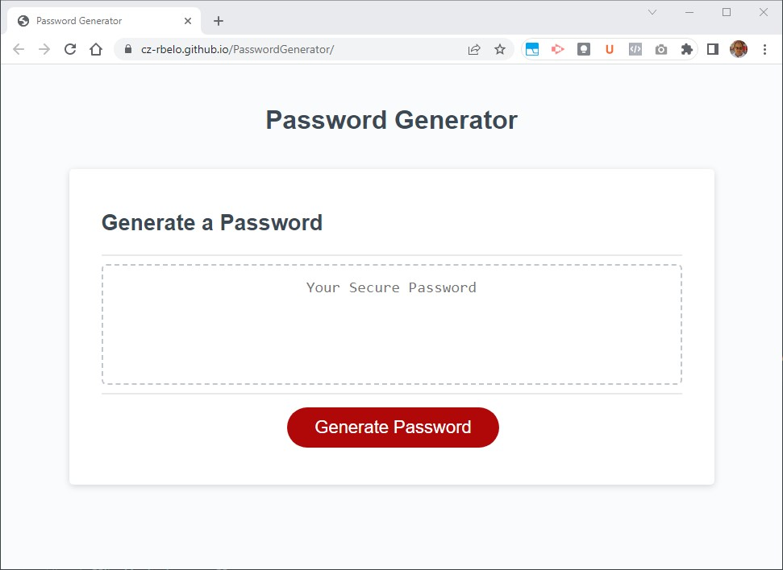

# Password Generator

### Repository

This is an application that can be used to generate a random password based on criteria selected by the user.  
This app will run in the browser and will feature dynamically updated HTML and CSS powered by JavaScript code.  
With a clean and polished user interface that is responsive, ensuring that it adapts to multiple screen sizes.

### Description

The Password Generator helps the user to create a strong password.  
It can include special characters, numeric characters, lowercase characters, and uppercase characters.

## Instructions

* The app generates a password when the button "Generate Password" is clicked  

  * Presents a series of prompts for password criteria  

    * Length of password must be at least 10 characters but no more than 64.  

    * Character types
      * Lowercase
      * Uppercase
      * Numeric
      * Special characters  

  * The code validate each input and at least one character type should be selected

  * Once prompts are answered then the password is written to the page

### Mock-Up  

The images below illustrates the **Password Generator** web page appearance:    

 
  
  
[Mobile web page mock-up version link](images/RB-PasswordGenerator-mobile-mockup.jpg) | [Tablet web page mock-up version link](images/RB-PasswordGenerator-tablet-mockup.png)

### Contributing  

Why you should contribute to an open-source project?  
Contributing to open-source is a rewarding way to learn, teach, and build experience in just about any skill.
You don’t have to contribute code, there’s always a task for you on an open-source project.
Besides coding, you can contribute to user interface design, graphic design, writing, or organizing.

Ways you can contribute:

* [Submit bugs and feature requests](https://github.com/CZ-RBelo/PasswordGenerator/issues/)
* [Review source code changes](https://github.com/CZ-RBelo/PasswordGenerator/pulls)

> **Spell check errors**  
>Pull requests that fix spell-check errors are welcomed.  
>If you want to give feedback or report an issue, please create a [new GitHub issue](https://github.com/CZ-RBelo/PasswordGenerator/issues/new).  
>**Please check if a topic about your issue already exists!**

### Links  

* [Github Repository](https://github.com/CZ-RBelo/PasswordGenerator)
* [Deployed Application](https://cz-rbelo.github.io/PasswordGenerator/)

### Credits  

### Contacts  

If you require any further information, feel free to contact me at:
 
* Github Profile: [CZ-RBELO](https://github.com/CZ-RBelo/)  
* Email: [jr.belo@hotmail.com](mailto:jr.belo@hotmail.com)
* LinkedIn: [Rui Belo](https://linkedin.com/in/ruibelo)

---
### License
Licensed under the [MIT license](https://github.com/CZ-RBelo/PasswordGenerator/blob/main/LICENSE)
